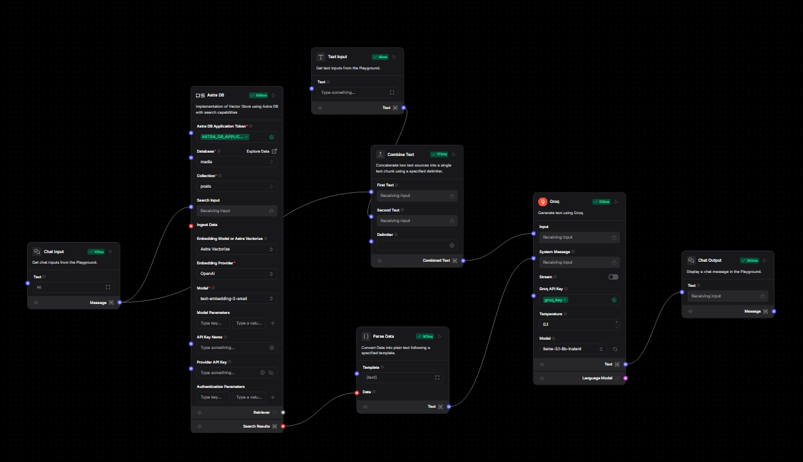

# Social Media Analytics Tool

## Live Application
Visit our live application: [Social Media Analytics Tool](https://analytics.genops.in/)

---

## Objective
The Social Media Analytics Tool is designed to help users analyze and gain insights into social media engagement data. It uses LangFlow for workflow orchestration and DataStax Astra DB for efficient and scalable data storage. The tool provides real-time analysis of metrics such as likes, shares, and comments, enabling users to understand the performance of different post types like images, videos, and carousels.

---

## Tech Stack
- **Python**: For backend processing.
- **Streamlit**: For building the user interface.
- **Plotly**: For interactive data visualization.
- **LangFlow**: For building workflows and AI-powered insights.
- **DataStax Astra DB**: For cloud-based database management.
- **OpenAI GPT**: For AI-powered insights.

---

## Architecture Diagram


---

## Workflow of the Architecture
1. **User Query**:
   - The user starts by entering a query (e.g., "How are carousel posts performing?") or selecting a post type for analysis on the Streamlit interface.

2. **Data Retrieval**:
   - The application fetches relevant social media engagement data (likes, shares, comments) from DataStax Astra DB using secure credentials.

3. **Data Processing**:
   - The data is filtered and processed based on user input. For example:
     - The `User ID` is extracted if required.
     - Metrics such as average likes or comments are calculated for different post types.

4. **AI-Powered Insights**:
   - The processed data is sent to LangFlow, which integrates with OpenAI GPT to generate insights (e.g., "Carousel posts have 20% higher engagement compared to static posts.").

5. **Results Visualization**:
   - The insights and engagement metrics are displayed on the dashboard using interactive visualizations built with Plotly.

This streamlined workflow ensures users can seamlessly analyze and gain actionable insights into social media performance.

---

## How to Run It Locally

### Prerequisites
- **Python** installed
- **DataStax Astra DB** account
- **LangFlow** set up locally
- **OpenAI API key**

### Steps
1. Clone the repository:
   ```bash
   git clone https://github.com/yogeshwarghule/social-media-performance-analysis.git
   cd social-media-performance-analysis
   ```

2. Install dependencies:
   ```bash
   pip install -r requirements.txt
   ```

3. Configure environment variables in a `.env` file:
   ```
   APP_TOKEN=your-app-token
   LANGFLOW_ID=your-langflow-id
   FLOW_ID=your-flow-id
   ```

4. Run the application:
   ```bash
   streamlit run Home.py
   ```

5. Access the application at the URL provided by Streamlit (e.g., `http://localhost:8501`).

---

## Demo Video
Watch the complete walkthrough of the Social Media Analytics Tool:
[Demo Video Link](#)
