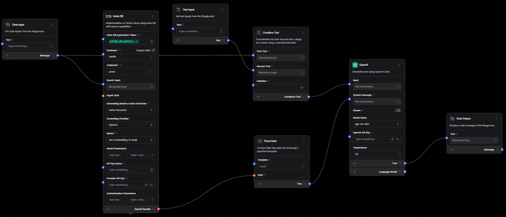
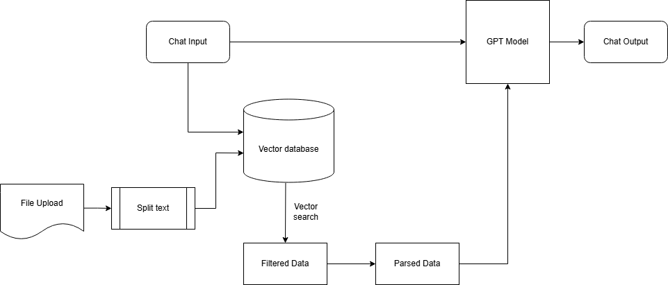

# Social Media Analytics Tool

[🔗 Visit the live application](https://analytics.genops.in/)

## 🚀 Overview

The **Social Media Analytics Tool** provides real-time insights into social media engagement data. It allows users to analyze metrics like likes, shares, and comments, helping assess the performance of post types (images, videos, carousels). Built with cutting-edge technologies like **[LangFlow](https://www.langflow.org/)** for workflow orchestration and **[DataStax Astra DB](https://astra.datastax.com/)** for scalable data storage, the tool delivers actionable insights through **AI-powered** analysis. The application is deployed on **[AWS EC2](aws.amazon.com)** for scalable hosting.

---

## 🔧 Tech Stack

- **Backend**: Python
- **Frontend**: Streamlit
- **Visualization**: Plotly
- **Workflow Orchestration**: LangFlow
- **Database**: DataStax Astra DB
- **AI Insights**: OpenAI GPT
- **Deployment**: AWS EC2

---

## 🧑‍💻 Key Features

- **Real-Time Social Media Analytics**: Track and visualize metrics in real-time.
- **AI-Driven Insights**: Understand the performance of posts (carousel, image, video) using AI insights.
- **Interactive Dashboards**: Easily view metrics with interactive Plotly visualizations.
- **Scalable and Secure**: Powered by DataStax Astra DB for efficient data management.

---

## 📊 Architecture



---

## 📊 Flowchart



---


## 🔄 Workflow

1. **User Query**:
   - Users input queries like "How are carousel posts performing?" or select post types for analysis via the Streamlit interface.

2. **Data Retrieval**:
   - Relevant social media engagement data (likes, shares, comments) is fetched securely from **[DataStax Astra DB](https://astra.datastax.com/)**.

3. **Data Processing**:
   - The data is filtered and processed based on user input. For example:
     - The `Post ID` is extracted if required.
     - Metrics such as average likes or comments are calculated for different post types.

4. **AI-Powered Insights**:
   - The processed data is sent to **[LangFlow](https://www.langflow.org/)**, which leverages **[OpenAI GPT](https://openai.com/chatgpt/overview/)** to generate insights such as "Carousel posts have 20% higher engagement compared to images."  

5. **Visualization**:
   - Insights and metrics are visualized interactively using **[Plotly](https://plotly.com/)** on the dashboard.

This streamlined workflow ensures users can seamlessly analyze and gain actionable insights into social media performance.

---

## 🚀 How to Run Locally

### Prerequisites

- Python (3.7 or higher)
- DataStax Astra DB account
- LangFlow installed locally
- OpenAI API key


### Steps
1. Clone the repository:
   ```bash
   git clone https://github.com/yogeshwarghule/social-media-performance-analysis.git
   cd social-media-performance-analysis
   ```

2. Set Up a Python Virtual Environment:
   - Install the virtual environment package:
     ```bash
     sudo apt install python3-venv -y
     ```
   - Create a virtual environment:
     ```bash
     python3 -m venv venv
     ```
   - Activate the virtual environment:
     ```bash
     source venv/bin/activate
     ```
   - Install the Python dependencies:
     ```bash
     cd app
     pip install -r requirements.txt
     ```

3. Configure environment variables in a `.env` file:
   ```
   APP_TOKEN=your-app-token
   LANGFLOW_ID=your-langflow-id
   FLOW_ID=your-flow-id
   ```

4. Run the application:
   ```bash
   cd app
   streamlit run Home.py
   ```

5. Access the application at the URL provided by Streamlit (e.g., `http://localhost:8501`).

---

## 🎥 Demo Video
Watch the complete walkthrough of the Social Media Analytics Tool:
[Demo Video Link](https://youtu.be/jUAeS3R44os)
